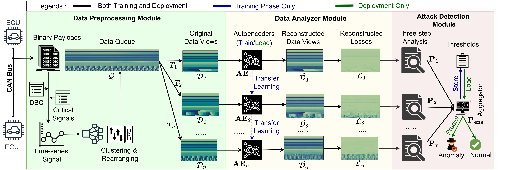
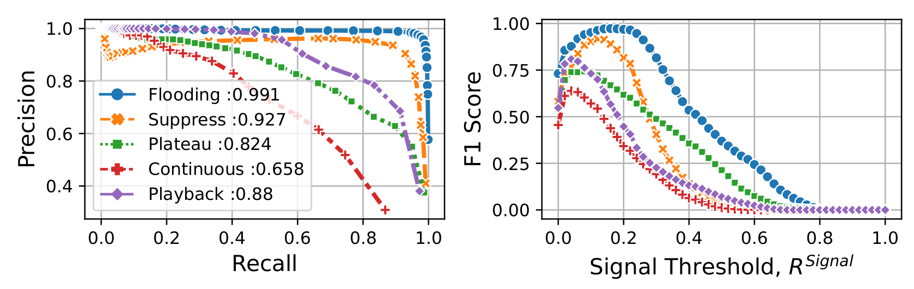
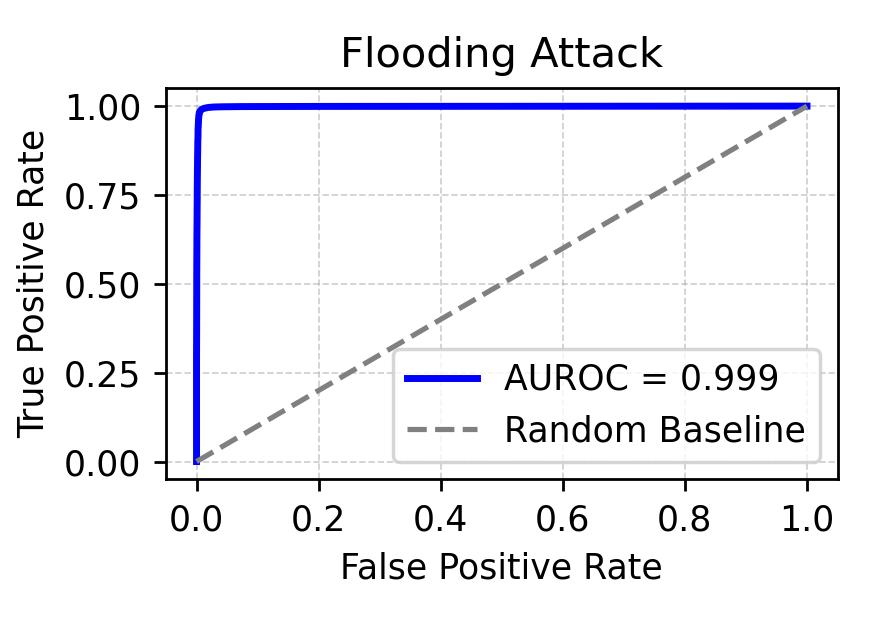
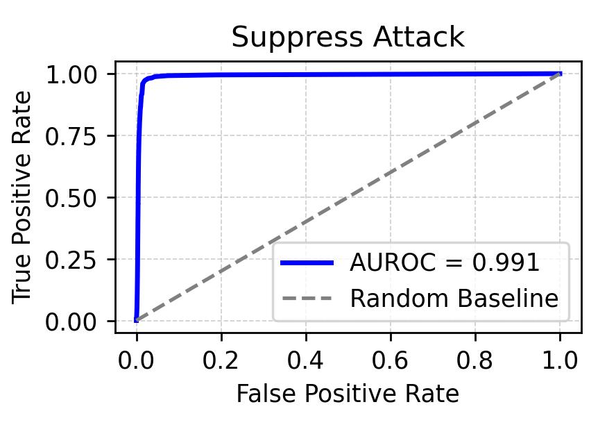
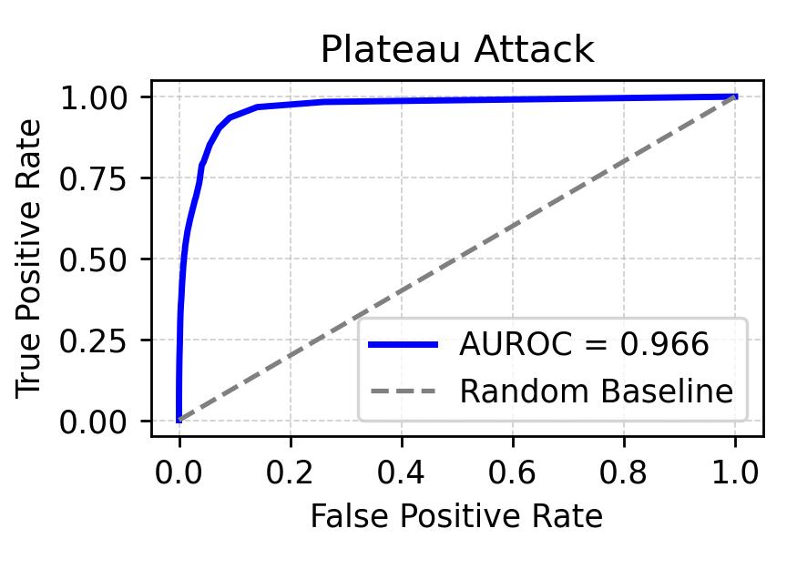
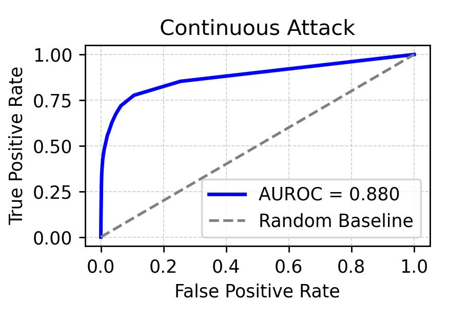
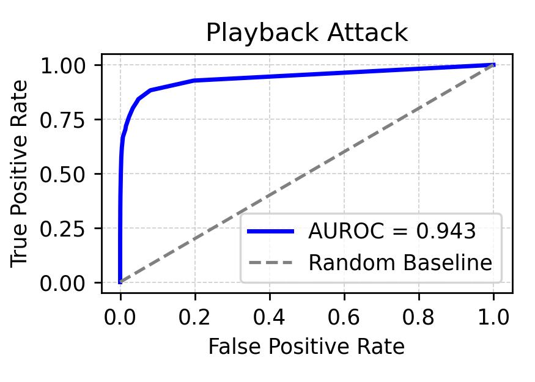

# CANShield
This is a official implementation of [CANShield](https://arxiv.org/abs/2205.01306), a deep learning-based signal-level intrusion detection framework for the CAN bus. CANShield consists of three modules: 1) a data preprocessing module that handles the high-dimensional CAN data stream at the signal level and parses them into time series suitable for a deep learning model; 2) a data analyzer module consisting of multiple deep autoencoder (AE) networks, each analyzing the time-series data from a different temporal scale and granularity; and 3) finally an attack detection module that uses an ensemble method to make the final decision.




## Clone CANShield

```
git clone https://github.com/shahriar0651/canshield.git
cd canshield
```

## Install Mambaforge
### Download and Install Mambaforge
```
wget https://github.com/conda-forge/miniforge/releases/latest/download/Mambaforge-$(uname)-$(uname -m).sh"
chmod +x Mambaforge-$(uname)-$(uname -m).sh
./Mambaforge-$(uname)-$(uname -m).sh
```

### Create Environment

We provide two environment configurations ([environment_v1](dependency/environment_v1.yaml) & [environment_v2](dependency/environment_v2.yaml)) which are optimized for different compuation setup. Create `canshield` environment using anyone of these (or customize as needed).

**Environment Comparison Table**  

| **Component**     | **Environment V1**            | **Environment V2**            |  
|------------------|----------------------------|----------------------------|  
| **Python**       | 3.9                        | 3.9                        |  
| **TensorFlow**   | 2.10                       | 2.15                       |  
| **Keras**        | 2.10                       | 2.15                       |  
| **CUDA**        | 11.7                        | 12.8                        |  
| **cuDNN**        | 8.5.0.96                    | 8.9.6.50                    |  
| **NumPy**        | 1.26.4                      | 1.26.4                      |  
| **GPU Tested**   | RTX 2080 Ti                 | Tesla P40                   |  

```
conda env create --file dependency/environment_v1.yaml
```
Or update the existing env
```
conda env update --file dependency/environment_v1.yaml --prune
```

### Activate Environment
```
conda activate canshield
```

## Download Dataset

### Download SynCAN Dataset

```
cd src
chmod +x download_syncan_dataset.sh
./download_syncan_dataset.sh
```

Here is the tree file structure after downloading the synCAN dataset:
```
datasets/
└── can-ids/
    └── syncan
        ├── ambients
        │   ├── train_1.csv
        │   ├── train_2.csv
        │   ├── train_3.csv
        │   └── train_4.csv
        ├── attacks
        │   ├── test_continuous.csv
        │   ├── test_flooding.csv
        │   ├── test_plateau.csv
        │   ├── test_playback.csv
        │   └── test_suppress.csv
        ├── License terms.txt
        └── README.md
```

## Building CANShield

### Training multiple autoencoders
```
python run_development_canshield.py
```

## Evaluating CANShield

### Testing on the test dataset
```
python run_evaluation_canshield.py
```

## Visualizing Results

### Visualize results on the test dataset
```
python run_visualization_results.py
```

## Results on Full Dataset
To replicate the original results reported in the paper, ensure the following configurations are set:

- `window_step_train: 1`
- `window_step_valid: 10`
- `window_step_test: 1`

Alternatively, you can either train the model or download the pre-trained weights from [Fully Trained Models](https://drive.google.com/drive/folders/1S9e-DCn2FmKpJCIM9EUndiPefipPvAPi?usp=sharing) and place them as the `artifacts/models/syncan/` directory.

| Model               | Flooding | Suppress | Plateau | Continuous | Playback | Average |
|---------------------|----------|----------|----------|------------|----------|----------|
| CANShield-1        | 0.940    | 0.860    | 0.907    | 0.853      | 0.927    | 0.898    |
| CANShield-5        | 0.997    | 0.976    | 0.944    | 0.837      | 0.905    | 0.932    |
| CANShield-10       | 0.994    | 0.978    | 0.924    | 0.814      | 0.888    | 0.920    |
| CANShield-Ens       | **0.997** | **0.985** | _0.961_ | _0.870_    | _0.948_  | **0.952** |
| CANShield-Base     | 0.958    | 0.877    | 0.896    | 0.835      | 0.909    | 0.895    |
| CANet             | _0.979_  | _0.882_  | **0.983** | **0.936** | **0.974** | _0.951_  |
| Reconstructive    | 0.903    | 0.496    | 0.755    | 0.563      | 0.532    | 0.650    |
| Predictive        | 0.874    | 0.489    | 0.722    | 0.561      | 0.530    | 0.635    |


| Model               | Flooding (TPR/FPR) | Suppress (TPR/FPR) | Plateau (TPR/FPR) | Continuous (TPR/FPR) | Playback (TPR/FPR) |
|---------------------|------------------|------------------|------------------|------------------|------------------|
| CANShield-1        | 0.581 / 0.009    | 0.166 / 0.008    | 0.420 / 0.007    | 0.361 / 0.007    | 0.657 / 0.006    |
| CANShield-5        | 0.992 / 0.010    | 0.820 / 0.008    | 0.482 / 0.009    | 0.353 / 0.007    | 0.594 / 0.004    |
| CANShield-10       | 0.976 / 0.008    | 0.846 / 0.009    | 0.429 / 0.009    | 0.247 / 0.006    | 0.589 / 0.005    |
| \sysname-Ens       | 0.988 / 0.009    | 0.781 / 0.010    | 0.486 / 0.009    | 0.427 / 0.010    | 0.689 / 0.008    |
| CANShield-Base     | 0.656 / 0.010    | 0.338 / 0.010    | 0.534 / 0.010    | 0.463 / 0.010    | 0.698 / 0.010    |
| CANet             | 0.901 / 0.004    | 0.613 / 0.004    | 0.955 / 0.025    | 0.765 / 0.006    | 0.905 / 0.004    |
| Reconstructive    | 0.688 / 0.005    | 0.001 / 0.007    | 0.361 / 0.074    | 0.016 / 0.025    | 0.029 / 0.005    |
| Predictive        | 0.644 / 0.006    | 0.003 / 0.007    | 0.330 / 0.026    | 0.015 / 0.006    | 0.020 / 0.004    |


### CANShield-Ens's PR curve with AUPRC and F1 Scores for different thresholds on SynCAN datasets.




## Results on Partical SynCAN Dataset

You can train the model with on a partial dataset or download the pre-trained weights from [Partially Trained Models](https://drive.google.com/drive/folders/1yP9Zinx_sIlNcxIiDoXBea4yqQCKZyyS?usp=sharing) and place them as the `artifacts/models/syncan/` directory.


For reproducibility with the scaled version, we report the results and models with the following configurations, which require approximately 10x fewer resources:

- `window_step_train: 10`
- `window_step_valid: 10`
- `window_step_test: 10`

The results of this scaled-down evaluation can be found below:


| Model            | Flooding | Suppress | Plateau | Continuous | Playback |
|-----------------|----------|----------|---------|------------|----------|
| CANShield-Base  | 0.988    | 0.906    | 0.943   | 0.866      | 0.926    |
| CANShield-1     | 0.968    | 0.875    | 0.926   | 0.864      | 0.930    |
| CANShield-5     | 0.997    | 0.983    | 0.943   | 0.842      | 0.901    |
| CANShield-10    | 0.996    | 0.977    | 0.937   | 0.818      | 0.878    |
| CANShield-Ens   | 0.999    | 0.990    | 0.954   | 0.909      | 0.947    |
| CANet           | 0.979    | 0.882    | 0.983   | 0.936      | 0.974    |
| Autoencoder     | 0.755    | 0.563    | 0.530   | 0.874      | 0.489    |
| Predictive      | 0.722    | 0.561    | 0.530   | 0.874      | 0.489    |


| Model          | Flooding        | Suppress        | Plateau        | Continuous      | Playback        |
|---------------|----------------|----------------|---------------|----------------|----------------|
|               | TPR / FPR       | TPR / FPR      | TPR / FPR     | TPR / FPR      | TPR / FPR      |
| CANShield-1   | 0.606 / 0.006   | 0.352 / 0.008  | 0.483 / 0.008 | 0.435 / 0.009  | 0.71 / 0.006   |
| CANShield-Base| 0.717 / 0.010   | 0.459 / 0.010  | 0.650 / 0.010 | 0.504 / 0.010  | 0.732 / 0.010  |
| CANShield-Ens | 0.990 / 0.008   | 0.865 / 0.010  | 0.509 / 0.009 | 0.455 / 0.008  | 0.669 / 0.007  |
| CANShield-5   | 0.980 / 0.005   | 0.945 / 0.010  | 0.462 / 0.008 | 0.388 / 0.008  | 0.571 / 0.007  |
| CANShield-10  | 0.986 / 0.008   | 0.824 / 0.007  | 0.461 / 0.008 | 0.304 / 0.006  | 0.523 / 0.008  |
| CANet         | 0.901 / 0.004   | 0.613 / 0.004  | 0.955 / 0.025 | 0.765 / 0.006  | 0.905 / 0.004  |
| Predictive    | 0.644 / 0.006   | 0.003 / 0.007  | 0.330 / 0.026 | 0.015 / 0.006  | 0.020 / 0.004  |
| Autoencoder   | 0.688 / 0.005   | 0.001 / 0.007  | 0.361 / 0.074 | 0.016 / 0.025  | 0.029 / 0.005  |




### Acknowledgements

We would like to thank the authors and contributors of the following open-source models and libraries, which were instrumental in this work:

- **[SynCAN Dataset](https://github.com/etas/SynCAN)**


## Citation
```bibtex
@article{shahriar2023canshield,
  title={CANShield: Deep-Learning-Based Intrusion Detection Framework for Controller Area Networks at the Signal Level}, 
  author={Shahriar, Md Hasan and Xiao, Yang and Moriano, Pablo and Lou, Wenjing and Hou, Y. Thomas},
  journal={IEEE Internet of Things Journal}, 
  year={2023},
  volume={10},
  number={24},
  pages={22111-22127},
  doi={10.1109/JIOT.2023.3303271}
}
```
